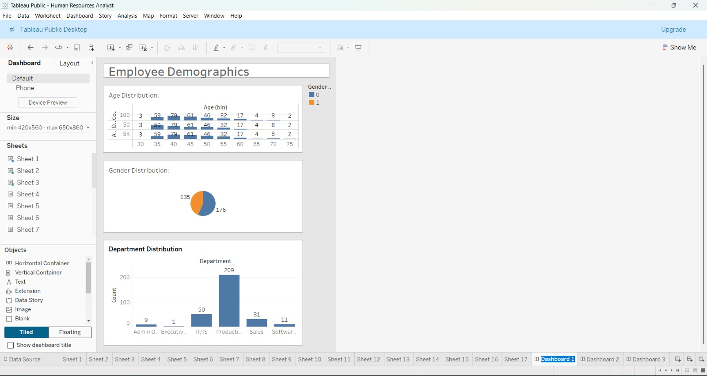
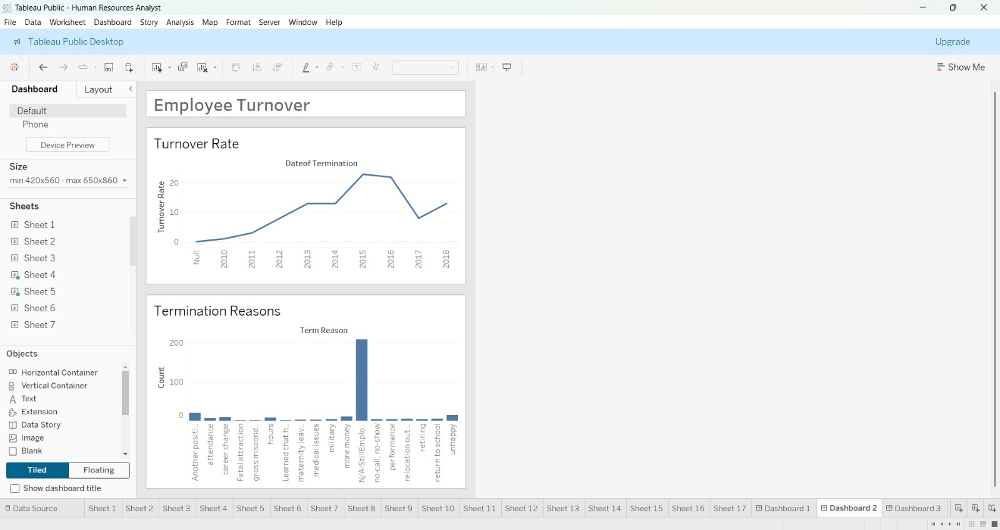
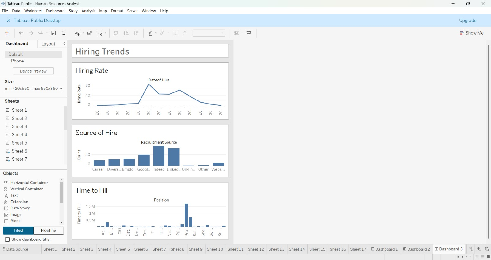

# HR Analytics Dashboard | Tableau

[](tableau/Human%20Resources%20Analyst.twbx)
[](data/HRDataset_v14_recovered.csv)
[](data/README.md)
[](#dashboard-previews)

An enterprise-grade **Human Resources Analytics Tableau Project** designed to analyze organizational workforce composition, employee attrition dynamics, recruitment channel effectiveness, performance ratings, and workplace engagement across **311 employee records**.



---

## Executive Summary & Key Metrics

| Metric | Verified Value | Analytical Definition |
| :--- | :--- | :--- |
| **Total Headcount Analyzed** | **311 Employees** | Total historical employee cohort across 6 business units |
| **Active Workforce** | **207 Staff (66.6%)** | Currently active employees (`N/A-StillEmployed`) |
| **Cumulative Terminations** | **104 Exits (33.4%)** | 88 Voluntary (84.6%), 16 Involuntary / For Cause (15.4%) |
| **Top Exit Driver** | **"Another Position" (20)** | Followed by "Unhappy" (14) and "More Money" (11) |
| **Primary Hiring Channel** | **Indeed (87) & LinkedIn (76)** | Sourced 52.4% of total organizational hires |
| **Mean Engagement Score** | **4.11 / 5.00** | Scale 1.00–5.00 (Total $\sum = 1,278.21$) |
| **Top Performance Rating** | **"Fully Meets" (78.1%)** | 243 Fully Meets, 37 Exceeds, 18 Needs Imp., 13 PIP |

---

## Project Objective

The primary objective of this project is to provide People Operations, Talent Acquisition, and Executive Leadership with interactive, data-driven dashboards to diagnose:
1. **Attrition Hotspots**: Pinpoint departments with elevated turnover and identify primary departure causes.
2. **Talent Acquisition ROI**: Evaluate sourcing channel volume, diversity yield, and hiring trends.
3. **Performance & Development Equity**: Identify top-performing contributors and evaluate stretch project distribution.

---

## Business Questions Answered

* **Workforce Demographics**: What is the age bracket and gender distribution across departments?
* **Turnover Drivers**: Which departments experience the highest attrition, and what are the root causes?
* **Recruitment Channel Performance**: Which channels deliver the highest volume and retention?
* **Performance Distribution**: How do performance ratings calibrate across direct managers?
* **Employee Engagement**: What is the relationship between engagement scores, special projects, and voluntary exits?

---

## Tools & Technologies

* **Tableau Desktop (v2024.1.2)**: Core business intelligence development, data modeling, visual calculations, and interactive dashboard authoring.
* **Tableau Calculated Fields & Bins**: Dynamic date calculations (`DATEDIFF`), aggregation functions (`COUNTD`, `SUM`), custom demographic bins (`Age (bin)`).
* **Tableau Hyper API & Python**: Extraction, data lineage recovery, and statistical recalculation (`pandas`, `numpy`, `tableauhyperapi`, `matplotlib`).

---

## Dataset Architecture & Lineage

The dataset was recovered directly from the embedded Tableau `.hyper` extract within the packaged workbook.

* **Source File**: `HRDataset_v14.csv` (Dr. Rich Huebner & Dr. Carla Prichard HR benchmark dataset).
* **Record Count**: 311 rows × 36 feature columns.
* **Data Nature**: Synthetic academic dataset containing fictional employee profiles for talent analytics modeling.
* **Data Dictionary**: Comprehensive column definitions available in [`data/README.md`](data/README.md).

---

## Dashboard Previews

### 1. Employee Demographics Dashboard
* **Worksheets Included**: Sheet 1 (Age Distribution by bin), Sheet 2 (Gender Distribution), Sheet 3 (Department Distribution).
* **Interactive Actions**: Department-level cross-filtering across age cohorts and gender ratios.


---

### 2. Employee Turnover Dashboard
* **Worksheets Included**: Sheet 4 (Turnover Rate Line Chart), Sheet 5 (Termination Reasons Bar Chart).
* **Key Finding**: 79.8% of all organizational terminations occurred within the Production department, led by voluntary departures for alternative job offers (20) and satisfaction concerns (14).



---

### 3. Hiring Trends Dashboard
* **Worksheets Included**: Sheet 6 (Hiring Rate Line Chart), Sheet 7 (Source of Hire Bar Chart), Sheet 8 (Time to Fill Bar Chart).
* **Key Finding**: Indeed (87) and LinkedIn (76) dominate candidate volume, while Employee Referrals (31) and Diversity Job Fairs (29) demonstrate high retention and diversification.



---

### 4. Performance & Engagement Views
* **Worksheets Included**: Sheet 9 (Performance Scores over Review Years), Sheet 10 (Leaderboard for Top Performers), Sheet 11 (Satisfaction Scores), Sheet 12 (Feedback Analysis).

| Sheet 9: Performance Scores | Sheet 10: Top Performers Leaderboard |
| :---: | :---: |
|  |  |

| Sheet 11: Satisfaction Scores | Sheet 12: Feedback Analysis |
| :---: | :---: |
|  |  |

---

## Key HR Calculated Fields

All calculated fields were reverse-engineered directly from the workbook XML and verified against the recovered dataset:

| Calculated Field | Original Tableau Formula | Function in Workbook |
| :--- | :--- | :--- |
| **Turnover Rate** | `IF ISNULL([DateofTermination]) THEN 0 ELSE 1 END` | Binary termination flag (summed to compute annual exit volume) |
| **Hiring Rate** | `COUNTD([EmpID])` | Distinct count of employee IDs per hiring year |
| **Time to Fill** | `DATEDIFF('day', [DOB], [DateofHire])` | Age-at-hire in days (applied proxy in student dataset) |
| **Is Terminated** | `IF ISNULL([DateofTermination]) THEN 0 ELSE 1 END` | Binary flag for predictive termination cross-tabulation |
| **Age** | `DATEDIFF('year', [DOB], TODAY())` | Dynamic employee age calculation in years |
| **Count** | `1` | Universal record counter for aggregated dimensions |

*Complete technical notes on formula interpretations and standard industry comparisons are documented in [`documentation/calculated-fields.md`](documentation/calculated-fields.md).*

---

## Strategic Business Recommendations

1. **Targeted Frontline Retention (Production)**:
   * Implement 18-month stay interviews and market-align technician hourly wages ($59k–$60k median) to curb voluntary exits citing *"Another position"* and *"More money"*.
2. **Democratize Stretch Projects**:
   * Expand Lean manufacturing and cross-functional continuous improvement projects to Production personnel to improve career mobility and engagement.
3. **Optimize Recruitment Budget Allocation**:
   * Maintain digital channels (LinkedIn/Indeed) for scale, but expand referral bonus programs and diversity recruitment partnerships due to superior retention stability.

---

## Repository Structure

```
HR-Analytics-Tableau/
├── README.md                              # Main project overview & executive summary
│
├── tableau/
│   └── Human Resources Analyst.twbx       # Original Tableau packaged workbook
│
├── data/
│   ├── HRDataset_v14_recovered.csv        # Recovered dataset (311 rows, 36 columns)
│   └── README.md                          # Data dictionary & extraction methodology
│
├── dashboards/
│   ├── dashboard-1.png                    # Actual Tableau Dashboard 1 screenshot
│   ├── dashboard-2.png                    # Actual Tableau Dashboard 2 screenshot
│   └── dashboard-3.png                    # Actual Tableau Dashboard 3 screenshot
│
├── analysis/
│   ├── data-overview.md                   # Detailed audit of 17 sheets & dataset structure
│   ├── hr-metrics.md                      # Formula reference & mathematical recalculations
│   ├── employee-analysis.md               # Demographic & pay equity breakdown
│   ├── attrition-analysis.md              # Turnover trends, causes & predictive factors
│   ├── hiring-analysis.md                 # Recruitment channel yields & timeline
│   └── key-insights.md                    # Core verified analytical findings
│
├── documentation/
│   ├── project-objective.md               # Business context & stakeholder value
│   ├── methodology.md                     # Data extraction & visualization design
│   ├── calculated-fields.md               # Complete formula dictionary & nuances
│   └── business-recommendations.md        # Actionable talent strategy recommendations
│
└── screenshots/
    ├── sheets/                            # Actual Tableau screenshots of all 17 worksheets
    ├── analysis/                          # Pay equity, predictive termination & diversity
    ├── calculations/                      # Calculated fields summary table
    └── dashboard-development/             # Dashboard screenshots & architecture
```

---

## How to Explore the Tableau Workbook

1. Download or clone this repository.
2. Open [`tableau/Human Resources Analyst.twbx`](tableau/Human%20Resources%20Analyst.twbx) in **Tableau Desktop (v2024.1 or later)** or **Tableau Reader** (free).
3. Interact with the 5 pre-built dashboards using the integrated click-to-filter actions.

---

## Skills Demonstrated

* **Business Intelligence & Data Visualization**: Interactive dashboard UI/UX design, visual hierarchy, cross-sheet filter actions.
* **Tableau Development**: Custom calculated fields, date manipulation (`DATEDIFF`), level of detail aggregations (`COUNTD`), custom bins.
* **People Analytics & Workforce Modeling**: Attrition analysis, talent acquisition channel yield, engagement correlation, pay equity benchmarking.
* **Data Reverse-Engineering & Validation**: Extraction of `.hyper` databases, schema verification, and statistical recalculation using Python.
