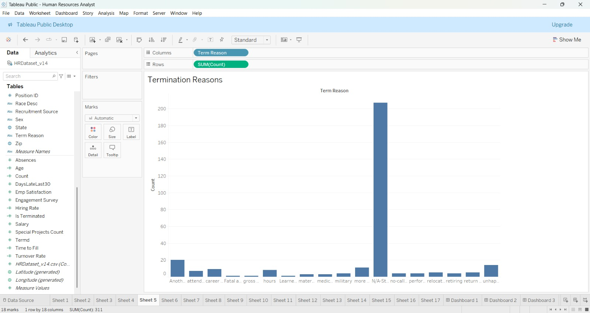
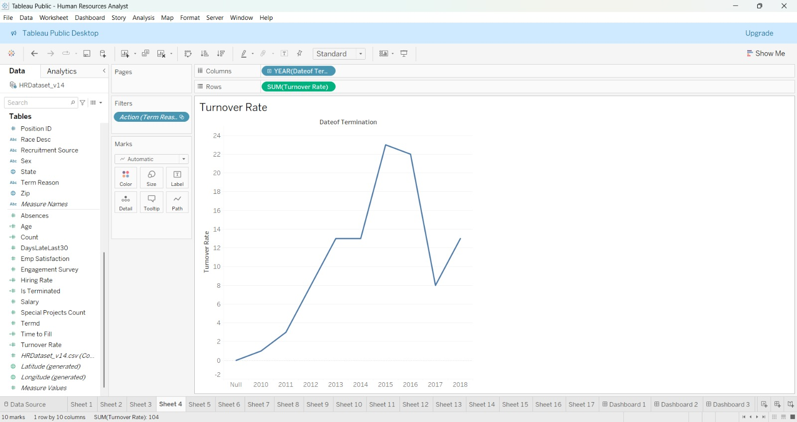
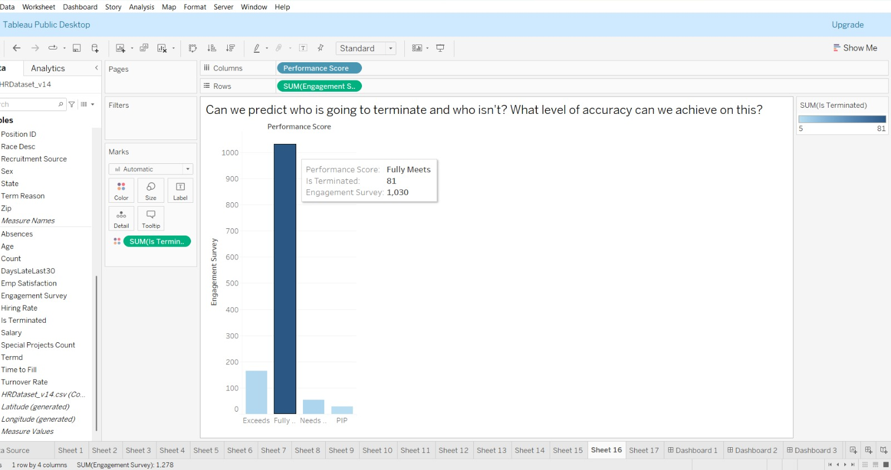

# Employee Attrition & Turnover Analysis

## Executive Summary

Across the 311 total recorded employees, **104 departures** have occurred historically, yielding a cumulative termination rate of **33.44%**.

* **Active Employees**: 207 (66.56%)
* **Voluntary Terminations**: 88 (84.62% of all exits)
* **Terminated for Cause**: 16 (15.38% of all exits)

---

## 1. Primary Reasons for Termination (Sheet 5)

In Sheet 5, `SUM(Count)` is plotted across all categories of `Term Reason`, displaying the active retained population alongside all departure causes:

| Termination Reason | Exits Count | % of All Exits | Primary Classification |
| :--- | :--- | :--- | :--- |
| **Another position** | 20 | 19.23% | Voluntary (Market Mobility) |
| **Unhappy** | 14 | 13.46% | Voluntary (Workplace Satisfaction) |
| **More money** | 11 | 10.58% | Voluntary (Compensation) |
| **Career change** | 9 | 8.65% | Voluntary (Career Pivot) |
| **Hours** | 8 | 7.69% | Voluntary (Work-Life Balance) |
| **Attendance** | 7 | 6.73% | Involuntary (Policy Violation) |
| **Relocation out of area** | 5 | 4.81% | Voluntary (Personal Relocation) |
| **Return to school** | 5 | 4.81% | Voluntary (Continuing Education) |
| **Performance** | 4 | 3.85% | Involuntary (Performance Management) |
| **Retiring** | 4 | 3.85% | Voluntary (Retirement) |
| **Military / Medical / Other** | 17 | 16.34% | Mixed Other Causes |
| *Active Retained (`N/A-StillEmployed`)* | 207 | - | Baseline Staff |

---

## 2. Turnover Trajectory Over Time (Sheet 4)

* Sheet 4 tracks `SUM(Turnover Rate)` across `YEAR(DateofTermination)` using a continuous line chart.
* **Peak Exit Period**: Departures peaked between 2014 and 2016 (over 20 terminations annually), following the major 2011 hiring expansion wave.

---

## 3. Predictive Attrition Indicators (Sheet 16)

* Sheet 16 analyzes the relationship between `Performance Score`, `SUM(Engagement Survey)`, and `SUM(Is Terminated)` (encoded on a color gradient from 5 to 81).
* **Key Finding**: The vast majority of terminations (81 exits) occurred within the **Fully Meets** performance tier (representing the bulk of voluntary departures seeking other opportunities), while lower performance tiers (**Needs Improvement** and **PIP**) exhibited high proportional exit rates.
