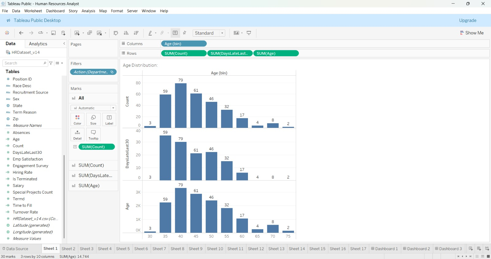
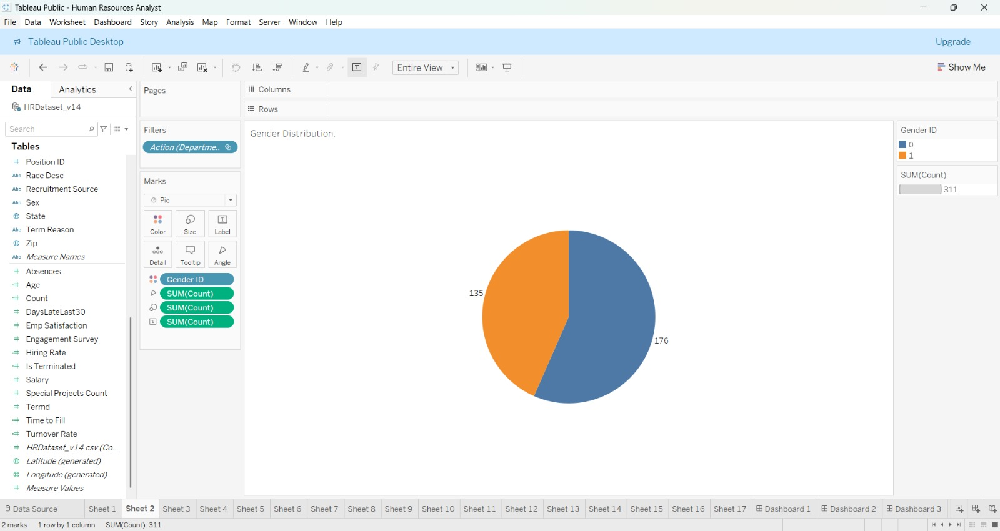
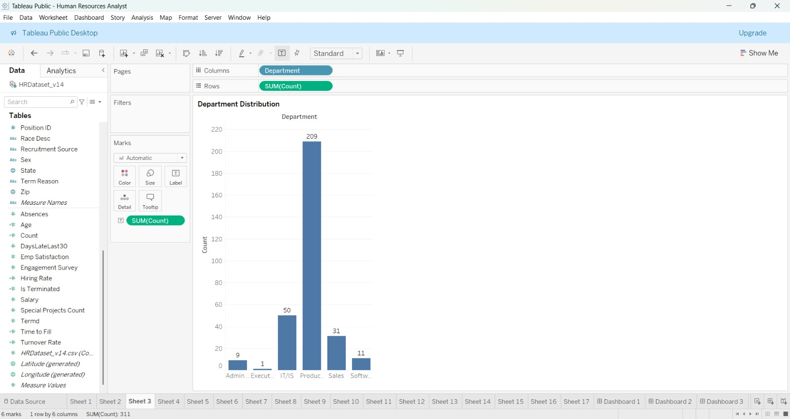
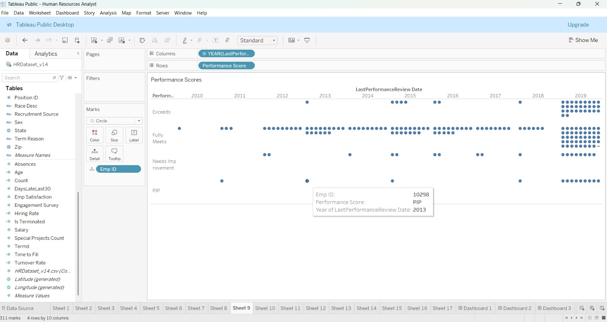
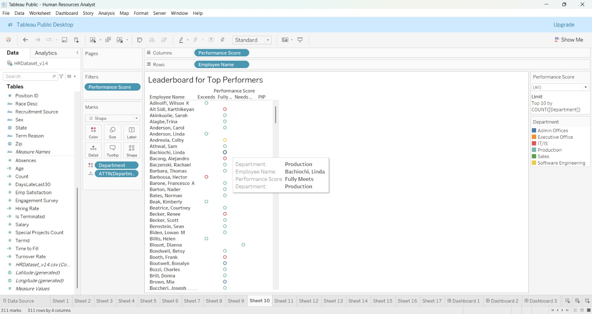
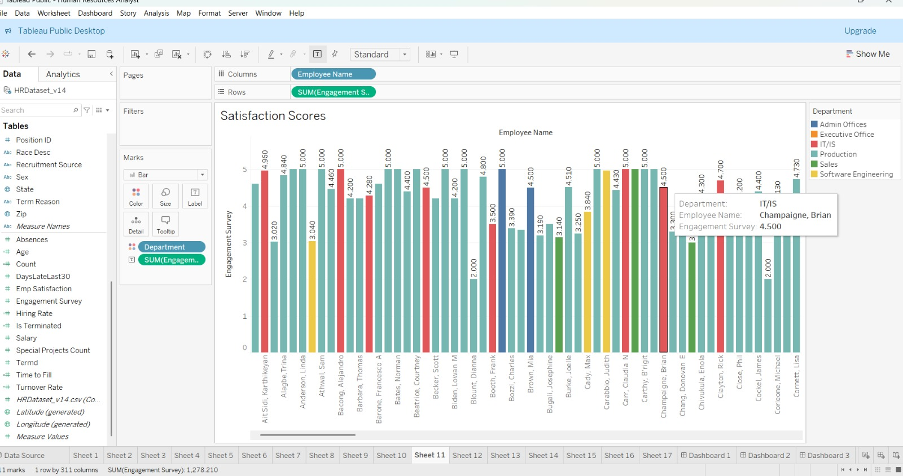
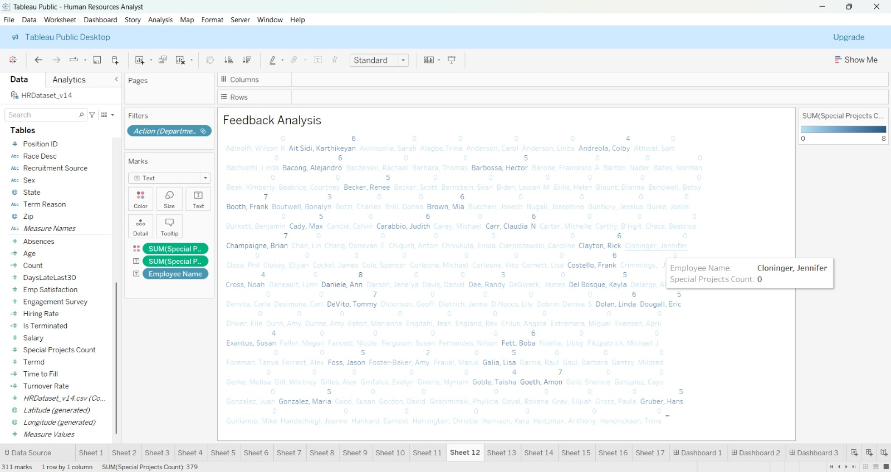
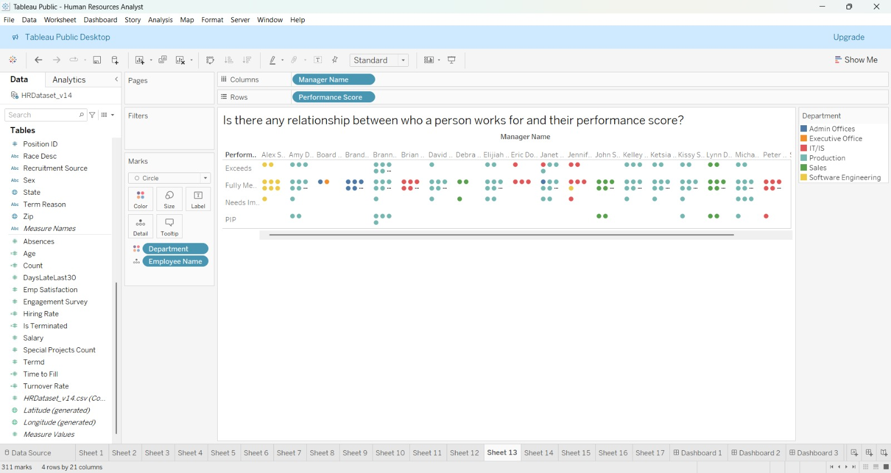
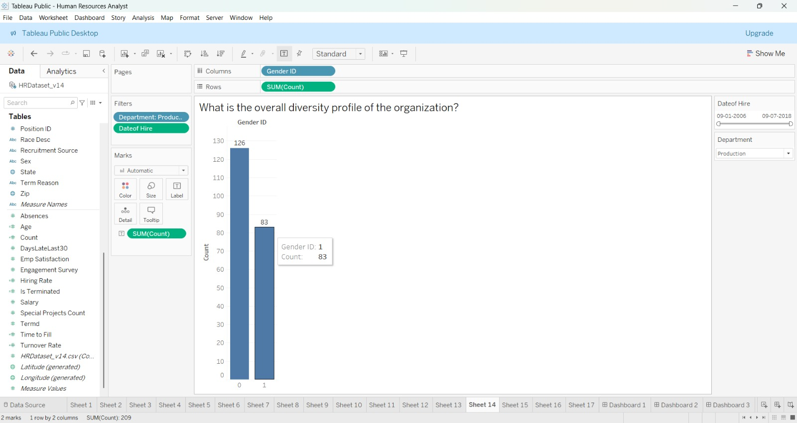
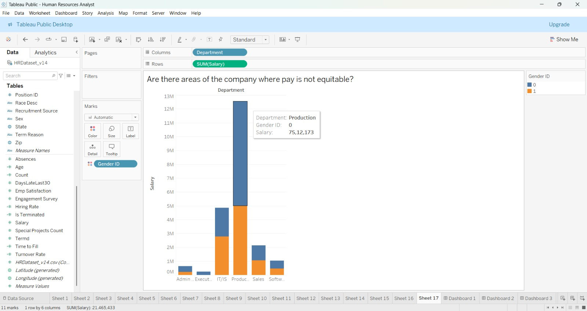

# Data & Worksheet Architecture Overview

## Dataset Summary Statistics

* **Total Records**: 311 employees
* **Active Headcount**: 207 employees (66.56%)
* **Terminated Headcount**: 104 employees (33.44%)
  * *Voluntarily Terminated*: 88 employees (84.62%)
  * *Terminated for Cause*: 16 employees (15.38%)
* **Total Departments**: 6
* **Recruitment Channels Recorded**: 9
* **Data Nature**: Academic Synthetic HR Benchmark Dataset (`HRDataset_v14.csv`)

---

## Comprehensive 17-Worksheet Inventory & Visual Architecture

The Tableau workbook [`Human Resources Analyst.twbx`](../tableau/Human%20Resources%20Analyst.twbx) contains **17 individual worksheets** structured across 5 production dashboards and exploratory research views:

| Sheet Name | Title / Analytical Purpose | Columns Shelf | Rows Shelf | Mark Type & Encoding | Primary Placement |
| :--- | :--- | :--- | :--- | :--- | :--- |
| **Sheet 1** | *Age Distribution* | `Age (bin)` | `SUM(Count)`, `SUM(DaysLateLast30)`, `SUM(Age)` | Automatic (Bar) with labels | **Dashboard 1** |
| **Sheet 2** | *Gender Distribution* | *(None)* | *(None)* | Pie (Color: `Gender ID`, Angle/Size: `SUM(Count)`) | **Dashboard 1** |
| **Sheet 3** | *Department Distribution* | `Department` | `SUM(Count)` | Automatic (Bar) with labels | **Dashboard 1** |
| **Sheet 4** | *Turnover Rate* | `YEAR(DateofTermination)` | `SUM(Turnover Rate)` | Line Chart (Historical exits) | **Dashboard 2** |
| **Sheet 5** | *Termination Reasons* | `Term Reason` | `SUM(Count)` | Automatic (Bar) | **Dashboard 2** |
| **Sheet 6** | *Hiring Rate* | `YEAR(DateofHire)` | `AGG(Hiring Rate )` | Line Chart (`COUNTD(EmpID)`) | **Dashboard 3** |
| **Sheet 7** | *Source of Hire* | `Recruitment Source` | `SUM(Count)` | Automatic (Bar) | **Dashboard 3** |
| **Sheet 8** | *Time to Fill* | `Position` | `SUM(Time to Fill)` | Automatic (Bar) | **Dashboard 3** |
| **Sheet 9** | *Performance Scores* | `YEAR(LastPerformanceReview Date)` | `Performance Score` | Circle (Detail: `Emp ID`) | **Dashboard 4** |
| **Sheet 10** | *Leaderboard for Top Performers* | `Performance Score` | `Employee Name` | Shape (Color: `Department`) | **Dashboard 4** |
| **Sheet 11** | *Satisfaction Scores* | `Employee Name` | `SUM(Engagement Survey)` | Bar (Color: `Department`) | **Dashboard 5** |
| **Sheet 12** | *Feedback Analysis* | *(None)* | *(None)* | Text Table (Color/Text: `SUM(Special Projects)`) | **Dashboard 5** |
| **Sheet 13** | *Manager vs. Performance Score* | `Manager Name` | `Performance Score` | Circle (Color: `Department`, Detail: `Emp Name`) | Exploratory View |
| **Sheet 14** | *Diversity Profile of Organization* | `Gender ID` | `SUM(Count)` | Automatic (Bar, Filter: `Department`) | Exploratory View |
| **Sheet 15** | *Diversity by Recruiting Source* | `Recruitment Source` | `SUM(Count)` | Stacked Bar (Color: `Gender ID`, Label: `Dept`) | Exploratory View |
| **Sheet 16** | *Predictive Termination Analysis* | `Performance Score` | `SUM(Engagement Survey)` | Bar (Color: `SUM(Is Terminated)`) | Exploratory View |
| **Sheet 17** | *Pay Equity Analysis* | `Department` | `SUM(Salary)` | Stacked Bar (Color: `Gender ID`) | Exploratory View |

---

## Actual Tableau Worksheet Gallery

### Demographics & Core Structure (Sheets 1, 2, 3)
| Sheet 1: Age Distribution | Sheet 2: Gender Distribution |
| :---: | :---: |
|  |  |

| Sheet 3: Department Distribution |
| :---: |
|  |

### Turnover & Hiring Metrics (Sheets 4, 5, 6, 7, 8)
| Sheet 4: Turnover Rate | Sheet 5: Termination Reasons |
| :---: | :---: |
|  |  |

| Sheet 6: Hiring Rate | Sheet 7: Source of Hire |
| :---: | :---: |
|  |  |

| Sheet 8: Time to Fill |
| :---: |
|  |

### Performance, Engagement & Research Inquiries (Sheets 9 to 17)
| Sheet 9: Performance Scores | Sheet 10: Top Performers Leaderboard |
| :---: | :---: |
|  |  |

| Sheet 11: Satisfaction Scores | Sheet 12: Feedback Analysis |
| :---: | :---: |
|  |  |

| Sheet 13: Manager vs Performance | Sheet 14: Diversity Profile |
| :---: | :---: |
|  |  |

| Sheet 15: Diversity by Recruiting Source | Sheet 16: Predictive Termination |
| :---: | :---: |
|  |  |

| Sheet 17: Pay Equity Analysis |
| :---: |
|  |
