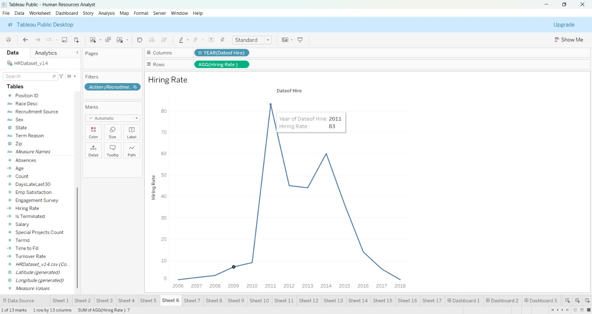
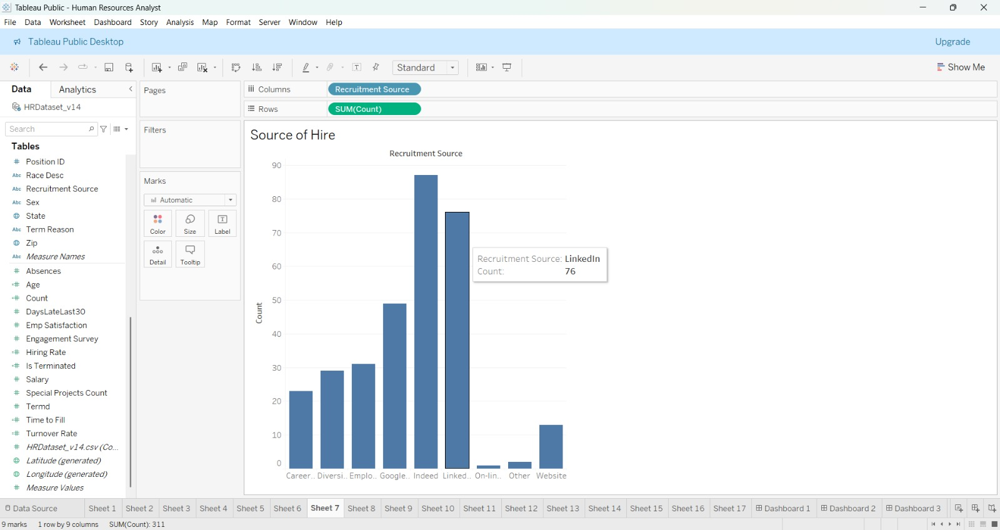
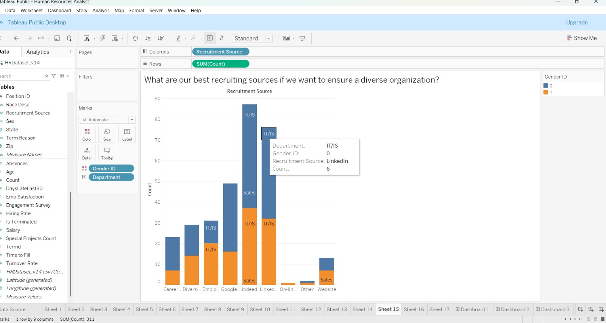
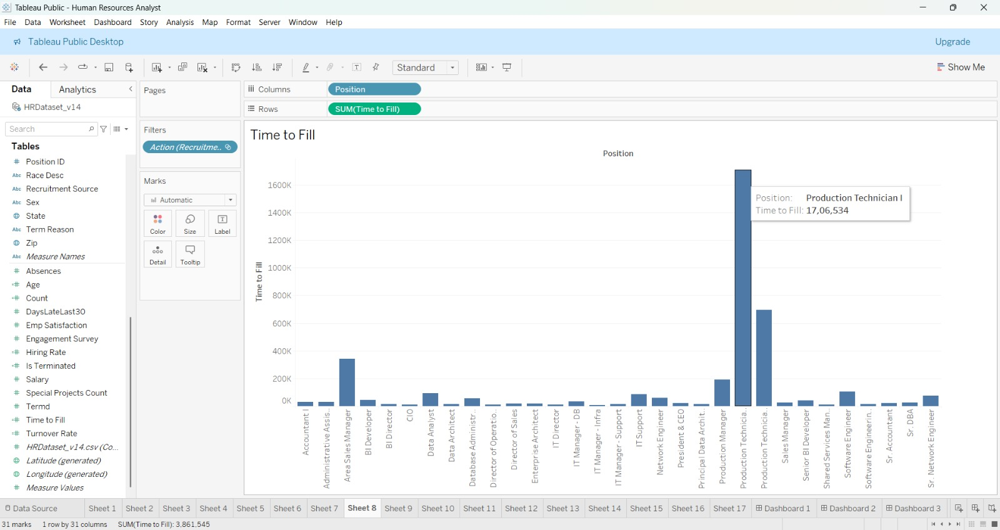

# Recruitment & Hiring Channel Analysis

## 1. Hiring Volumes Over Time (Sheet 6)

The organizational hiring trajectory exhibits distinct growth phases captured in Sheet 6 via `AGG(Hiring Rate )` across `YEAR(DateofHire)`:

* **Initial Ramp-up (2006–2010)**: Steady baseline onboarding (1–8 hires annually).
* **Peak Expansion (2011)**: Massive operational surge with **83 recorded hiring events / 77 unique hires** (Sheet tooltip confirms peak volume).
* **Secondary Growth Wave (2012–2014)**: Sustained hiring between 40 and 60 hires annually.
* **Normalization (2015–2018)**: Backfill and maintenance hiring.

---

## 2. Recruitment Channel Performance (Sheet 7)

| Recruitment Channel | Total Hires | % of Total Hires | Primary Roles Sourced |
| :--- | :--- | :--- | :--- |
| **Indeed** | 87 | 27.97% | Production Technicians, IT Support |
| **LinkedIn** | 76 | 24.44% | Data Analysts, BI Developers, Sales Managers |
| **Google Search** | 49 | 15.76% | Production Technicians, Sales Reps |
| **Employee Referral** | 31 | 9.97% | Software Engineers, Production Technicians |
| **Diversity Job Fair** | 29 | 9.32% | Production Technicians, Admin Assistants |
| **CareerBuilder** | 23 | 7.40% | Production Technicians |
| **Company Website** | 13 | 4.18% | Operations, IT Infrastructure |
| **Other / Online Application** | 3 | 0.96% | Specialized Roles |

---

## 3. Recruitment Sources & Diversity Breakdown (Sheet 15)

* In Sheet 15, recruitment source headcount is broken down by `Gender ID` (0 = Blue = Female, 1 = Orange = Male) with `Department` labels.
* Demonstrates balanced gender sourcing across primary platforms (Indeed: 44 Female / 43 Male; LinkedIn: 48 Female / 28 Male).

---

## 4. Time to Fill & Position Level Analysis (Sheet 8)

* In Sheet 8, `SUM(Time to Fill)` is aggregated across 31 individual job positions, totaling **3,861,545 days** across all records.
* **Production Technician I**: Accounts for **1,706,534 days** (reflecting 137 individual hires in this large entry-level cohort).
* **Area Sales Manager**: Accounts for **342,154 days** (27 hires).
